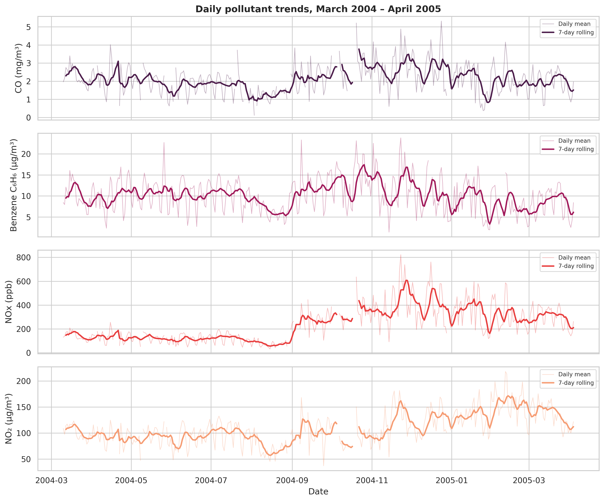
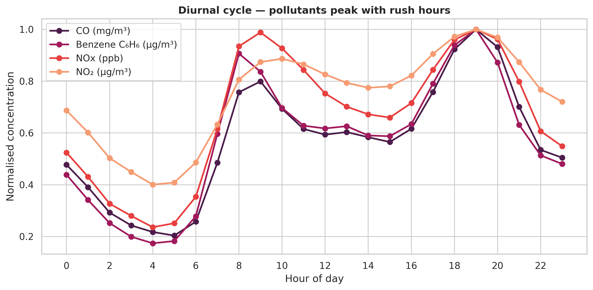
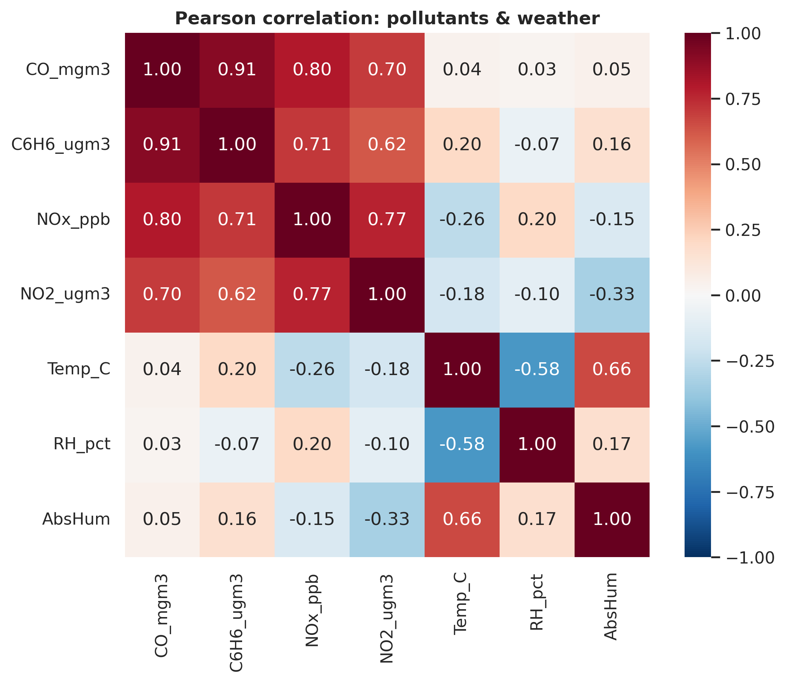
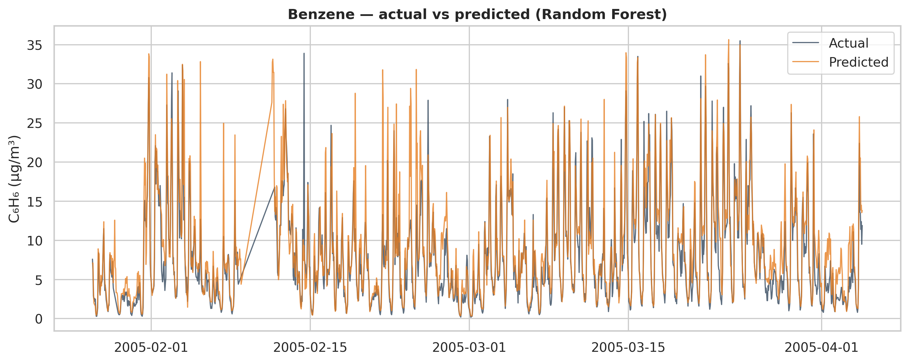

# Historical Air Quality Analysis in Python

A reproducible exploratory and predictive analysis of hourly air-quality and meteorological measurements from the UCI Air Quality dataset. The project examines temporal pollution patterns, pollutant-weather relationships, missing sensor data, and the predictive signal of environmental variables for benzene concentrations.

## Why this project

Air-quality monitoring data are messy, time-dependent, and closely linked to public-health and environmental decisions. This project was developed as an academic mini-project and expanded into a portfolio analysis to demonstrate practical skills in:

- cleaning and structuring environmental sensor data;
- working with hourly time-series observations;
- analysing daily, monthly, diurnal, and weekday/weekend patterns;
- exploring pollutant-weather relationships;
- producing reproducible visualisations and statistical summaries; and
- comparing simple predictive models using a chronological train/test split.

## Dataset

The analysis uses the **Air Quality** dataset from the UCI Machine Learning Repository. It contains roughly 9,300 hourly records from a multisensor device deployed at road level in a polluted Italian urban area, alongside reference measurements for pollutants including carbon monoxide (CO), benzene (C₆H₆), nitrogen oxides (NOx), and nitrogen dioxide (NO₂), plus meteorological variables.

- UCI dataset: https://archive.ics.uci.edu/dataset/360/air+quality
- DOI: https://doi.org/10.24432/C59K5F
- Citation: De Vito, S. et al., *Air Quality*, UCI Machine Learning Repository.

Missing readings in the source file are encoded as `-200`.

## Research questions

1. How do major pollutant concentrations vary over time?
2. What daily, seasonal, and weekday/weekend patterns are visible?
3. How strongly are pollutants related to one another and to temperature and humidity?
4. Can benzene concentrations be estimated from co-located pollutant, weather, and time-of-day variables?

## Data cleaning

The workflow:

1. converts source `-200` sentinel values to missing values;
2. combines date and time into a proper datetime index;
3. removes empty trailing columns and blank rows;
4. drops NMHC from the analytical dataset because more than 90% of its observations are missing; and
5. uses time-based interpolation with a six-observation limit in each direction, while retaining unresolved missing values where interpolation is not appropriate.

The treatment of NMHC is a deliberate data-quality decision rather than an attempt to impute a largely unavailable variable.

### Missing-data treatment

Time-based interpolation was applied with a six-observation limit in each direction, while unresolved missing values were retained. The impact of interpolation was explicitly assessed:

| Variable | Missing before | Missing after | Values filled |
|---|---:|---:|---:|
| CO | 1,683 | 1,181 | 502 |
| Benzene | 366 | 240 | 126 |
| NOx | 1,639 | 1,062 | 577 |
| NO₂ | 1,642 | 1,064 | 578 |
| Temperature | 366 | 240 | 126 |
| Relative humidity | 366 | 240 | 126 |
| Absolute humidity | 366 | 240 | 126 |

This approach avoids treating interpolation as a substitute for genuinely unavailable observations and makes the effect of preprocessing transparent.

## Analysis

The project includes:

- descriptive statistics;
- daily and monthly aggregation;
- seven-day rolling trends;
- mean diurnal pollution profiles;
- weekday versus weekend comparisons;
- Pearson correlation analysis;
- pollutant-weather scatter analysis; and
- linear regression and Random Forest models for contemporaneous benzene prediction.

The predictive component is **not a future forecasting model**. It estimates benzene using co-located pollutant, meteorological, and temporal features. A chronological 80/20 split is used so that later observations are held out for evaluation.

## Visual Results

### Pollutant trends over time



Daily pollutant concentrations and seven-day rolling means show substantial temporal variation across the March 2004 to April 2005 observation period.

### Diurnal pollution patterns



Average hourly profiles reveal pronounced morning and evening pollution peaks, illustrating how pollutant concentrations vary systematically throughout the day.

### Pollutant and weather relationships



The correlation structure highlights strong relationships among several combustion-related pollutants, alongside associations between pollutant concentrations and meteorological conditions.

### Benzene predictive modelling



The Random Forest model captures substantial variation in benzene concentrations during the chronologically held-out test period, achieving approximately **R² = 0.77**.

Additional visualisations, including weekday–weekend comparisons and Random Forest feature importance, are available in [`outputs/figures/`](outputs/figures/).

## Selected findings

- CO, benzene, NOx, and NO₂ form a strong positive correlation cluster, with several pairwise correlations of approximately **r = 0.6–0.9**. This pattern is consistent with shared combustion-related sources, including road traffic.
- Average diurnal pollutant profiles show pronounced morning and evening peaks, consistent with changes in commuting-hour activity.
- Mean NOx concentrations are approximately **27% lower on weekends than on weekdays** in this dataset. This is an observational association and is not interpreted as a causal traffic or policy effect.
- NOx and NO₂ concentrations increase markedly from October onward, coinciding with cooler conditions. Seasonal changes in emissions and atmospheric dispersion may contribute to this pattern.
- CO and benzene concentrations decline during late summer.
- Linear Regression and Random Forest models capture substantial predictive signal for benzene. Using a chronological 80/20 train-test split, the Random Forest achieves approximately **R² = 0.77** on the held-out period.

## Limitations

This is an exploratory analysis of a single monitoring site covering about 13 months. Results should not be generalized to other cities without validation. The analysis does not establish causal effects of traffic or environmental policy, and weather, seasonality, and human activity may be confounded. NMHC is excluded because the source variable is more than 90% missing.

## Repository structure

```text
air-quality-analysis-python/
├── .gitignore
├── README.md
├── requirements.txt
├── data/
│   ├── raw/
│   │   ├── README.md
│   │   └── AirQualityUCI.csv
│   └── processed/
│       ├── README.md
│       ├── airquality_clean.csv
│       ├── airquality_daily.csv
│       └── airquality_monthly.csv
├── notebooks/
│   ├── README.md
│   └── AirQuality_Analysis.ipynb
├── src/
│   ├── README.md
│   └── analysis.py
├── outputs/
│   ├── figures/
│   │   ├── benzene_actual_vs_predicted.png
│   │   ├── correlation_matrix.png
│   │   ├── daily_pollutant_trends.png
│   │   ├── diurnal_cycle.png
│   │   ├── monthly_pollutant_levels.png
│   │   ├── pollutant_weather_scatter.png
│   │   ├── random_forest_feature_importance.png
│   │   └── weekday_weekend.png
│   ├── README.md
│   ├── correlation.csv
│   ├── missingness_before_cleaning.csv
│   ├── model_results.csv
│   └── summary_stats.csv
└── reports/
    ├── README.md
    └── Air_Quality_Report.pdf
```

## How to reproduce the analysis

### 1. Clone the repository

```bash
git clone https://github.com/cbosiemo/air-quality-analysis-python.git
cd air-quality-analysis-python
```

### 2. Create and activate a virtual environment

```bash
python -m venv .venv
```

On macOS/Linux:

```bash
source .venv/bin/activate
```

On Windows:

```bash
.venv\Scripts\activate
```

### 3. Install dependencies

```bash
pip install -r requirements.txt
```

### 4. Run the analysis

The original dataset is included in `data/raw/` for reproducibility.

Run the standalone analysis:

```bash
python src/analysis.py
```

Or open the Jupyter notebook:

```bash
jupyter notebook notebooks/AirQuality_Analysis.ipynb
```

## Tools

Python · pandas · NumPy · Matplotlib · Seaborn · scikit-learn · Jupyter Notebook

## Author

**Cynthia Osiemo**  
**MSc Data Science Student | Research Analyst | Economics** 
GitHub: https://github.com/cbosiemo

## Acknowledgement

This project uses the UCI Machine Learning Repository Air Quality dataset. Dataset creators and UCI retain attribution for the underlying data. The analysis, code, interpretation, and portfolio presentation in this repository are the author's work.
